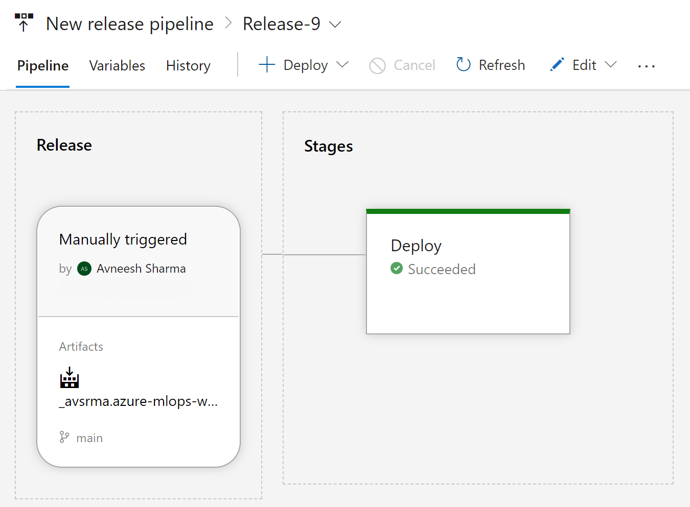

# Automated MLOps Workflow 
This respository provides a template for building automated MLOps workflows using Azure Machine Learning Studio and Azure DevOps. 

### Getting Started
Setup a resource group in MS Azure containing an Azure Machine Learning Workspace. Follow instructions in the initial [Setup guide](setup/Setup_README.md). 

Once the initial setup is done you should be able to proceed with development. 

The development workflow is structured as follows: 
- Initial Setup: Install required prerequisites such as a compute cluster.
- Data: Describing location of the dataset, whether local or on cloud. 
- ML: Development of Components, e.g., a Dataloader, Model Training, Evaluation, etc. 
- MLOps: Describing an automated Job Pipeline that can perform ML-model lifecycle tasks like data loading, training, evaluation, etc. and then storing the trained model in the Azure Workspace.  
- Deploy: Describing production dependencies and requirements, such as an Environment and Endpoint for model serving. 

The MLOps and Production is brought together by the Azure Pipeline which automatically trains and deploys the model on an endpoint. 


### Configure defaults 
Set the default Resource Group and Workspace so you don't need to provide them with every command. 

```
az configure --defaults group=${RESOURCE_GROUP} workspace=${WORKSPACE_NAME}
```

### Data 
You can build any necessary ETL pipelines, download data from an online source, Azure blob store, or a datalake. It's also possible to upload a local dataset. Regardless of the source, an Azure data asset can be created based on descriptions in the corresponding `.yml` file using the CLI command:  

```
az ml data create -f data/data.yml
```

It may also make sense to share the data asset in the Registry. This can be done using: 

```
az ml data share --name <example-name> --version <version-in-workspace> --share-with-name <name-in-registry> --share-with-version <version-in-registry> --registry-name <registry-name>
```

Additional documentation can be found [here](https://learn.microsoft.com/en-us/azure/machine-learning/how-to-share-data-across-workspaces-with-registries?view=azureml-api-2&tabs=cli#share-data-from-workspace-to-registry). 

### ML (Components)
In this repository, sample components can be found under the `ml` directory. The suggested development workflow is to develop Python code for components in VS Code. Particularly so versioning can be done via Git. When bringing various components together to build a Pipeline, this can be achieved with a `pipeline.yml` or via "Designer" in Azure ML Studio. 

Components are organized in individual directories consisting of the required Python code and a YML file. 
```
ml/
├── component_1/
│   ├── code.py
│   └── component.yml
├── component_2/
│   ├── code.py
│   └── component.yml
...
└── component_n/
```

Connect to the compute cluster from Workspace using the command palette in VS Code, type: `Azure ML Compute Instances`. You can also start a remote Jupyter server as necessary. 

Upload all components to the Workspace at once by running the shell script 
```
bash ml/create_components.sh
```

### MLOps 
This Azure Pipeline Job along with the development Environment is defined in the `mlops` directory. As part of the experimentation phase, the pipeline job to create a model asset in the Workspace can be simply triggered by running the shell script: 
```
bash mlops/run_pipeline_job.sh
```
The script prompts the user if they would also like to deploy the model. This deployment refers to a `dev` online-endpoint creation and deployment based on the **model inside Azure Workspace**. The `run_pipeline_job.sh` script calls the `create_endpoint_deployment.sh` script for a `dev` deployment. 

The same pipeline jobs is also used as part of an automated MLOps workflow. This automates the process of training, deploying, and evaluating the machine learning model once the experimentation phase is complete. The experimentation is completed when a pipeline designed in ML Studio or otherwise is run and generates a model as its output. 

Core principle behind automated MLOps workflow is to streamline the process of model improvement. This may be subjective to the use-case. Nevertheless, the general process is standard: 
- The model is trained/fine-tuned based on a given set of hyperparameters 
- The model is packaged & versioned in a Model Registry 
- The model performance is evaluated 
- Optionally, the model is deployed 
- Performance is monitored 
- Repeat 


This streamlined process is achieved through a Continuous Integration/Continuous Deployment/Continuous Training (CI/CD/CT) workflow. **Along with the model being packaged and versioned in the Registry, the ML Components are shared and versioned there as well.** 

### Deployment 
The `deploy` directory defines various files that are necessary for deployment. We deploy two different online-endpoints in this repository, `dev` and `auto`. 
- `dev-`endpoint: Deployed based on ML Components and Model from the Azure Workspace. 
- `auto-`endpoint: Deployed based on ML Components and Model from the Registry. 

Both deployments use the same deployment YMLs as defined in the `deploy` directory but we use the `--set` argument to provide updates to the necessary arguments, such as, `model` or `endpoint_name`. 

Online-deployment in Azure requires a deployment configuration (see `deploy/blue-deployment.yml`), endpoint configuration (see `deploy/endpoint.yml`), and the _production_ Environment. It's also possible to use the same Environemnt as used for `dev` but we recommend using a separate Environment for staging/production purposes. This is defined by `deploy/environment.yml` and `deploy/conda.yml`.

[Read more about online-deployment in Azure.](https://learn.microsoft.com/en-us/cli/azure/ml/online-deployment?view=azure-cli-latest#az-ml-online-deployment-create)

### Git/Azure Workflow 
MLOps automation workflow is defined in `azure-pipelines.yml`. The pipeline is triggered whenever changes are pushed to the main branch of the associated Git repository. The workflow performs the following operations: 
- Installs AzureML CLI, a necessary extension  
- Submits an AzureML pipeline job and monitors its completion
- Updates and registers ML Components to the Registry for reusability
- Shares the trained model for deployment in Registry 
- Publishes the model metadata and deployment as an Artifact. This can be used for an Azure DevOps Release Pipeline. 
- Manages the endpoint and deployment of the trained model for inference. 

Appropriate customizations may be required for to the workflow to restrict deployments, for example, based on model performance. 

Environment variables must be created apprioriately. Either in GitHub/GitLab or on Azure DevOps. 

[Creating Environment Variables in GitHub.](https://docs.github.com/en/actions/learn-github-actions/variables) 

If using Azure DevOps, once your Git repository is connected, you should be able to see the workflows (created in Git or otherwise) under Pipelines. 

From there navigate to `Your Pipeline -> Edit -> Variables` to add appropriate environment variables. 

<div style="width: 40%; height: 40%">
  
  
  
</div>

To reproduce the pipeline in this repository, the following environment variables for `$RESOURCE_GROUP` and `$WORKSPACE_NAME` must be created. 


### Azure DevOps 
While the model can be deployed through Azure Pipelines [(or GitHub Actions)](https://learn.microsoft.com/en-us/azure/machine-learning/how-to-github-actions-machine-learning), release pipelines may be created in Azure DevOps with additional deployment environments. Generally Staging and Production. Appropriate triggers must be created which may be manual or automatic. 

[Guided instructions on Setting up MLOps deployment workflow using Azure DevOps can be found here.](https://learn.microsoft.com/en-us/azure/machine-learning/how-to-setup-mlops-azureml)

Once the repository is connected to Azure DevOps and the deployment pipeline is functional, verify that the artifacts are available. Releases can then be created. The release pipeline would have at least the following two steps: 

Installing Azure CLI ML Extension:
```
az extension add -n ml -y
```

and Deploy Model: 
```
az ml online-deployment create \
--file $(DEPLOYMENT_YML) \
--resource-group $(RESOURCE_GROUP) \
--workspace-name $(WORKSPACE_NAME) \
--all-traffic
```
 
A successful release would show all the environments where the model is deployed. In the image below, there is one deployment. 

